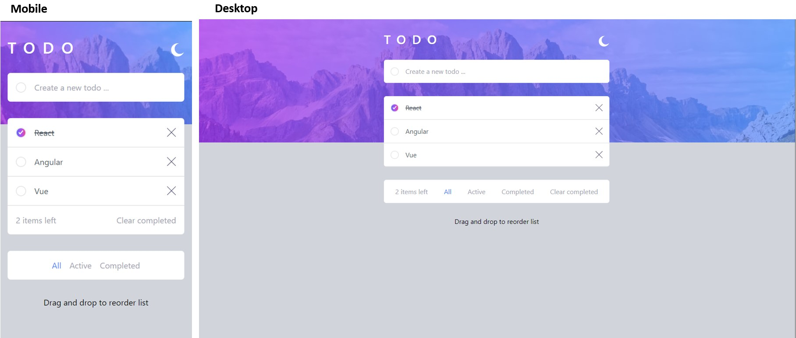
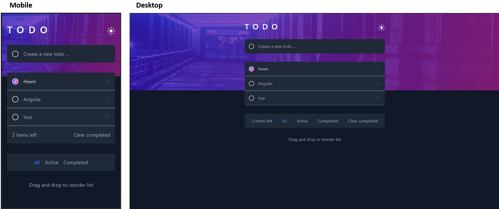

# To-do's app

This is a simple to-do application built using React and Vite, enabling users to create, update, and delete items in a to-do list. Also, users can filter by the to-do's state and perform drag-and-drop actions to sort them.

# Designs

## Light mode

## Dark mode

